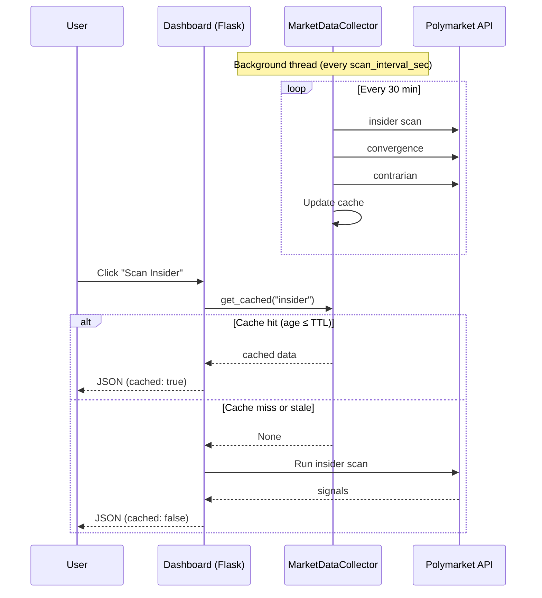

# PolySuite Run Mode — Implementation Plan

**Scope:** A "run" mode where the bot runs continuously, collects market data in the background, and when dashboard scan buttons (Insider/Whale, Convergence, Contrarian) are hit, data is already flowing and possibly pre-cached. Scanners run automatically 1–2× per hour unless manually triggered.

**Handoff:** This plan is for implementation. No code changes in this document.

---

## 1. Architecture: How Run Mode Works

### 1.1 Current State

| Component | Current Behavior |
|----------|------------------|
| `main.py run` | Maps to `handle_dashboard_command` (same as `dashboard`) |
| `main.py dashboard` | Maps to `handle_dashboard_command` |
| Both commands | Pass `api_factory` → Dashboard creates `MarketDataCollector` |
| `MarketDataCollector` | Exists in `src/collector/runner.py`; runs every 90s (capped from `monitor_interval`) |
| Scan APIs | Use cache when `collector` exists and `force` not set; else run scan on-demand |

**Problem:** `run` and `dashboard` are identical. User wants:
- **`dashboard`**: Standalone dashboard, no background collector; scans only when user clicks.
- **`run`**: Dashboard + background collector; data pre-cached; scans 1–2×/hour automatically.

### 1.2 Target Architecture

```
┌─────────────────────────────────────────────────────────────────────────┐
│  python main.py run                                                      │
├─────────────────────────────────────────────────────────────────────────┤
│                                                                          │
│  ┌──────────────────────┐     ┌──────────────────────────────────────┐ │
│  │  Flask Dashboard     │     │  MarketDataCollector (background)      │ │
│  │  - Serves UI         │     │  - Daemon thread                       │ │
│  │  - /api/insider/scan │◄────│  - Runs every scan_interval_sec        │ │
│  │  - /api/convergence/ │     │  - Caches: insider, convergence,      │ │
│  │  - /api/contrarian/  │     │    contrarian, active_markets          │ │
│  └──────────────────────┘     └──────────────────────────────────────┘ │
│           │                                    │                         │
│           │  GET /api/insider/scan             │  _collect_all()         │
│           │  → cache hit? return cached        │  every 30–60 min        │
│           │  → cache miss? run scan            │                         │
│           │  → force=1? run fresh scan         │                         │
│           └────────────────────────────────────┘                         │
│                                                                          │
└─────────────────────────────────────────────────────────────────────────┘
```

### 1.3 Command Flow

| Command | `api_factory` to Dashboard | Collector | Scan Behavior |
|---------|---------------------------|-----------|----------------|
| `dashboard` | `None` (or omit) | No | On-demand only; each Scan click runs full scan |
| `run` | `APIClientFactory(config)` | Yes | Cache-first; background scans 1–2×/hour; manual Scan can use cache or force |

### 1.4 Process Model

- **Single process:** Flask + one daemon thread for `MarketDataCollector`
- **No separate worker process:** Simpler to manage; no IPC
- **Graceful shutdown:** `Ctrl+C` → Flask stops → `collector.stop()` → `api_factory.close()`

---

## 2. MarketDataCollector Design

### 2.1 What to Cache

| Key | Content | Used By |
|-----|---------|---------|
| `insider` | `{ok, signals, count, ts}` | `/api/insider/scan` |
| `convergence` | `{ok, convergences, count, ts}` | `/api/convergence/check` |
| `contrarian` | `{ok, signals, count, ts}` | `/api/contrarian/scan` |
| `active_markets` | `{ok, markets, count, ts}` | Future alert tracking |

### 2.2 Scan Intervals

| Setting | Default | User Requirement | Notes |
|---------|---------|------------------|-------|
| `scan_interval_sec` | 1800 (30 min) | 1–2× per hour | 30–60 min between full runs |
| `monitor_interval` | 300 | — | Currently used; repurpose or deprecate for collector |

**Recommendation:** New config key `scan_interval_sec` (default 1800). Clamp to 30–3600 s. Do not use `monitor_interval` for collector (it is for monitor polling).

### 2.3 Cache TTL

| Setting | Default | Behavior |
|---------|--------|----------|
| `cache_ttl_sec` | 600 (10 min) | If cache age > TTL, return `None` → API runs fresh scan |

**Rationale:**  
- User clicks Scan → if cache hit and age ≤ TTL → return cached (fast).  
- If cache stale → return `None` → API runs scan → user sees fresh data but slower.  
- Background collector runs every `scan_interval_sec`; cache is typically fresh within TTL.

### 2.4 Thread Safety

- Use `threading.Lock` for cache read/write (already in `_cache`).
- `get_cached()`: read under lock; return copy or None.
- `_collect_*()`: write under lock after computation.
- No shared mutable state outside lock.

### 2.5 Collector Lifecycle

```
Dashboard.__init__(api_factory=X)
  → if X: collector = MarketDataCollector(...)
  → else: collector = None

Dashboard.run()
  → if collector: collector.start()  # daemon thread
  → app.run()

# On process exit (Ctrl+C):
  → Flask SIGINT handler
  → collector.stop()  # set _stop, join thread
  → api_factory.close()
```

**Gap:** Dashboard does not call `collector.stop()` on shutdown. Flask `app.run()` blocks; when interrupted, process exits. Daemon thread dies with process. For clean shutdown, register `atexit` or signal handler to call `collector.stop()`.

---

## 3. API Behavior: Cache vs Fresh

### 3.1 Decision Matrix

| Condition | Cache Used? | Fresh Scan? |
|-----------|-------------|-------------|
| No collector | — | Yes |
| Collector exists, `force=1` | No | Yes |
| Collector exists, cache hit, age ≤ TTL | Yes | No |
| Collector exists, cache miss or age > TTL | No | Yes |

### 3.2 Stale Threshold

- **Stale = cache age > `cache_ttl_sec`**
- `get_cached()` returns `None` when stale → API falls through to on-demand scan.

### 3.3 Response Format

- Include `cached: true` and `cached_at: <iso>` when serving from cache (optional).
- Include `cached: false` when running fresh scan.

### 3.4 UI: Force Refresh

- Scan buttons: use cache by default.
- Add optional "Force refresh" button or long-press → `?force=1`.

---

## 4. Config: New Keys

| Key | Type | Default | Description |
|-----|------|---------|-------------|
| `scan_interval_sec` | int | 1800 | Seconds between background collector runs (30 min). Clamp 30–3600. |
| `cache_ttl_sec` | int | 600 | Cache TTL in seconds. Consider cache stale after this. Clamp 60–3600. |
| `run_mode_enabled` | bool | true | When true, `run` starts collector. (Alternative: infer from command.) |

**Existing keys used:**

- `monitor_interval` — do **not** use for collector; keep for monitor loop.
- `insider_min_size`, `contrarian_min_volume`, `contrarian_min_imbalance`, `win_rate_threshold`, `min_trades_for_high_performer` — already used by detectors.

---

## 5. Implementation Order and File Changes

### Phase 1: Fix main.py (Low Risk)

**File:** `main.py`

1. **Remove duplicate/broken block (lines ~518–546)**  
   - Second `config`/`storage`/`api_factory` init, `TaskManager`, and command routing are dead/incorrect.  
   - Delete this block; keep only the `command_map` execution path.

2. **Split `run` vs `dashboard` handlers**
   - `handle_dashboard_command`: pass `api_factory=None` so Dashboard runs without collector.
   - Add `handle_run_command`: pass `api_factory` so Dashboard starts collector.
   - Update `command_map`: `"run"` → `handle_run_command`, `"dashboard"` → `handle_dashboard_command`.

3. **Optional:** Add `TaskManager` start/stop only for commands that need it (e.g. `monitor`), not for `run`/`dashboard`.

### Phase 2: Config (Low Risk)

**File:** `src/config/__init__.py`

1. Add to `DEFAULT_CONFIG`:
   - `scan_interval_sec`: 1800
   - `cache_ttl_sec`: 600

2. Add properties:
   - `scan_interval_sec`
   - `cache_ttl_sec`

### Phase 3: MarketDataCollector (Medium Risk)

**File:** `src/collector/runner.py`

1. Use `config.get("scan_interval_sec", 1800)` for interval; clamp 30–3600.
2. Use `config.get("cache_ttl_sec", 600)` for TTL; clamp 60–3600.
3. Remove dependency on `monitor_interval` for collector interval.

**File:** `src/dashboard/app.py`

1. Pass `scan_interval_sec` and `cache_ttl_sec` from config to `MarketDataCollector`.
2. Register shutdown hook: `atexit` or `signal.signal(SIGINT, ...)` to call `collector.stop()` before exit.

### Phase 4: Dashboard Collector Init (Low Risk)

**File:** `src/dashboard/app.py`

1. When `api_factory` is provided, create collector with:
   - `interval_sec=config.scan_interval_sec` (or `config.get("scan_interval_sec", 1800)`)
   - `cache_ttl_sec=config.cache_ttl_sec` (or `config.get("cache_ttl_sec", 600)`)

### Phase 5: API Response Metadata (Optional, Low Risk)

**File:** `src/dashboard/app.py`

1. For `/api/insider/scan`, `/api/convergence/check`, `/api/contrarian/scan`:
   - When returning cached data, add `cached: true`, `cached_at: <iso>`.
   - When running fresh, add `cached: false`.

### Phase 6: UI Force Refresh (Optional, Low Risk)

**File:** `src/dashboard/templates/index.html`

1. Add "Force refresh" or secondary action to each Scan button.
2. Call `fetch('/api/insider/scan?force=1')` (and equivalents) when forced.

---

## 6. How to Stop All Instances (Windows)

### 6.1 Single Instance

- **Ctrl+C** in the terminal running `python main.py run`.

### 6.2 Multiple Orphaned Instances

**Option A: Task Manager**

1. Open Task Manager (Ctrl+Shift+Esc).
2. Find `python.exe` or `pythonw.exe` with command line containing `main.py` or `PolySuite`.
3. End task for each.

**Option B: PowerShell (by script name)**

```powershell
Get-Process python* | Where-Object { $_.CommandLine -like "*main.py*" } | Stop-Process -Force
```

Note: `CommandLine` may not be available on all Windows; use `wmic` if needed.

**Option C: WMIC**

```cmd
wmic process where "commandline like '%main.py%'" get processid
taskkill /PID <pid> /F
```

**Option D: Port-based (if dashboard binds to fixed port)**

```powershell
# Find process using port 5000 (Flask default)
netstat -ano | findstr :5000
taskkill /PID <pid> /F
```

### 6.3 Graceful Shutdown Script (Optional)

Create `scripts/stop_polysuite.ps1`:

```powershell
# Stop all PolySuite Python processes
Get-Process python* -ErrorAction SilentlyContinue | ForEach-Object {
    try {
        $cmd = (Get-CimInstance Win32_Process -Filter "ProcessId=$($_.Id)").CommandLine
        if ($cmd -like "*main.py*" -or $cmd -like "*polysuite*") {
            Stop-Process -Id $_.Id -Force
            Write-Host "Stopped PID $($_.Id)"
        }
    } catch {}
}
```

### 6.4 Run as Service (Future)

- Use `nssm`, `pywin32`, or Windows Service to run `main.py run`.
- Provide `stop`/`restart` commands for the service.

---

## 7. Summary Checklist

| # | Task | File(s) | Risk |
|---|------|---------|------|
| 1 | Remove duplicate/broken block in main.py | main.py | Low |
| 2 | Split run vs dashboard handlers | main.py | Low |
| 3 | Add scan_interval_sec, cache_ttl_sec to config | src/config/__init__.py | Low |
| 4 | Use new config in MarketDataCollector | src/collector/runner.py | Medium |
| 5 | Pass interval/ttl from Dashboard to collector | src/dashboard/app.py | Low |
| 6 | Register collector.stop() on shutdown | src/dashboard/app.py | Low |
| 7 | (Optional) Add cached/cached_at to API responses | src/dashboard/app.py | Low |
| 8 | (Optional) Add Force refresh in UI | index.html | Low |
| 9 | Document stop commands for Windows | README or docs | — |

---

## 8. Risk Notes

| Risk | Mitigation |
|------|------------|
| Collector thread blocks Flask | Collector runs in daemon thread; scans are I/O-bound. Use timeouts in API clients. |
| Cache stampede | Single writer (collector); readers get snapshot. No stampede. |
| Config typo | Use `config.get("key", default)` with sensible defaults. |
| Orphaned processes | Document stop procedures; consider PID file for `run` mode. |

---

## 9. Mermaid: Run Mode Data Flow



---

*End of plan. Ready for implementation handoff.*
